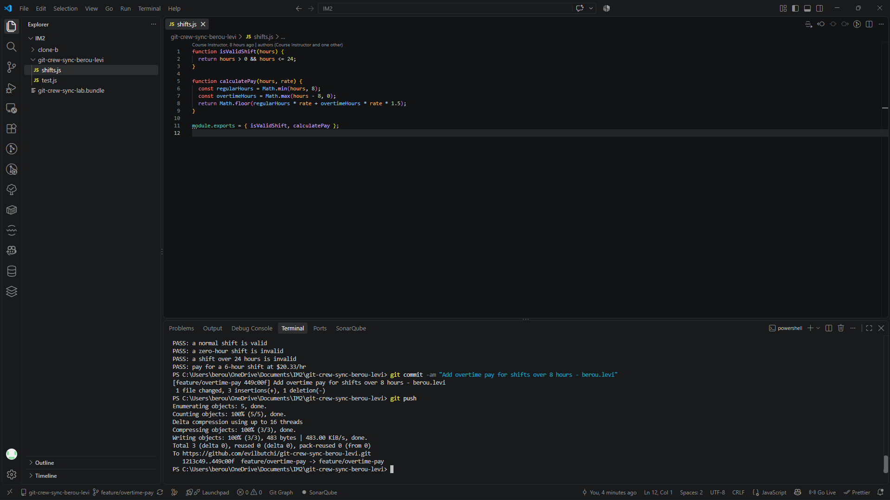
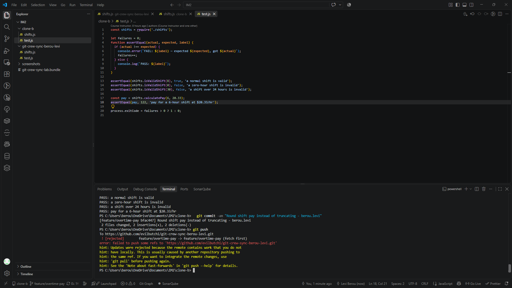
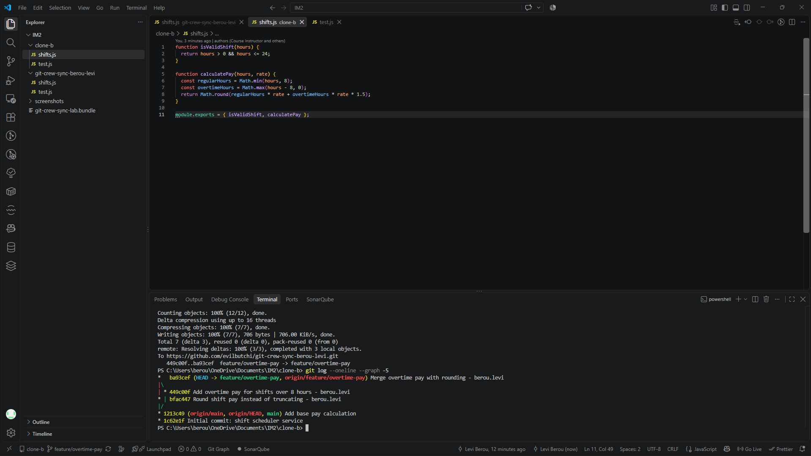
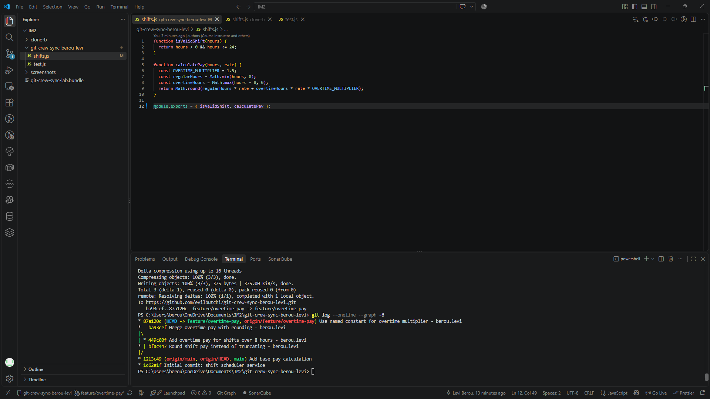
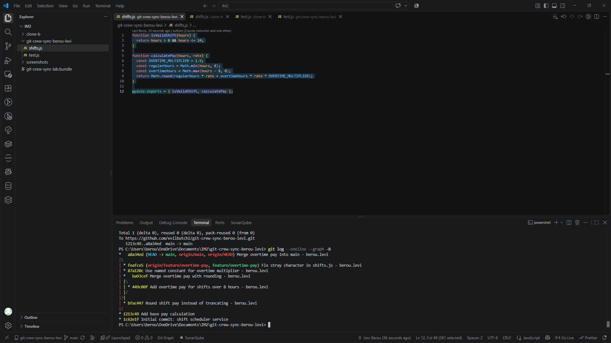
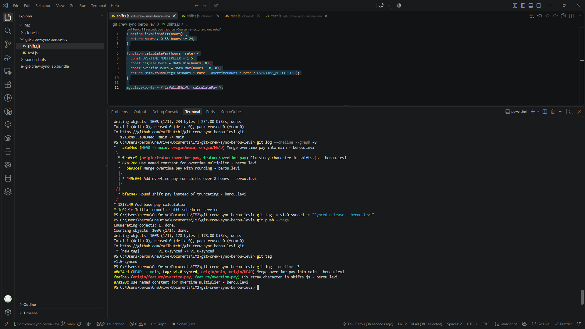
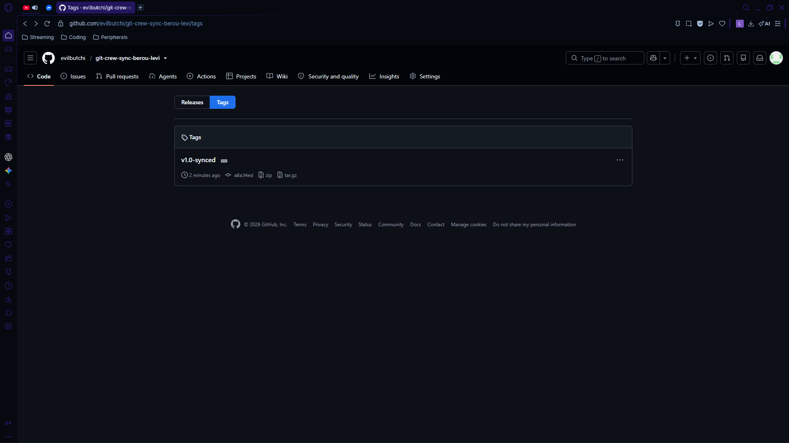

# Crew Sync - WORKFLOW

## Task 1: Push a change from Clone A
Added overtime pay (time-and-a-half after 8 hours) to `calculatePay` on `feature/overtime-pay` and pushed from Clone A.

## Task 2: Diverge from Clone B and get rejected
In Clone B, without fetching, I changed `calculatePay` to use `Math.round` instead of `Math.floor`, committed, and tried to push. The push was rejected.

## Task 3: Reconcile with a merge
In Clone B I ran `git fetch` and `git merge origin/feature/overtime-pay`, resolved the conflict in `shifts.js` so both overtime pay and rounding survive, confirmed the tests pass, and pushed.

## Task 4: Diverge again and reconcile with a rebase
In Clone A, without fetching, I changed `calculatePay` again (named constant for the overtime multiplier) and got rejected. I then ran `git fetch` and `git rebase origin/feature/overtime-pay`, resolved the conflict, continued the rebase, and pushed without force.

## Task 5: Merge into main
Merged `feature/overtime-pay` into `main` and pushed. The branch includes a small fix commit that removed a stray character I had accidentally committed in `shifts.js`.

## Task 6: Tag
Tagged the final merge commit `v1.0-synced` and pushed the tag.

## Questions

### 1. What did the rejected push error message tell you, and why did it happen?
The push failed with `! [rejected] feature/overtime-pay -> feature/overtime-pay (fetch first)`, and the hint said the remote contains work that I do not have locally. It happened because Clone A had already pushed the overtime commit (`449c00f`) to `feature/overtime-pay`, while Clone B had never fetched it. My rounding commit (`bfac447`) was built on the older commit `1213c49`, so the two branches had diverged. A push has to be a fast-forward, and mine wasn't. Git refused it so that it wouldn't overwrite the commit that was already on the remote.

### 2. What's the actual difference between how you resolved Task 3 (merge) vs Task 4 (rebase)?
In Task 3 I ran `git fetch` and `git merge`, fixed the conflict in `shifts.js`, and committed. That created a new merge commit (`ba93cef`) with two parents, so both lines of history are kept and the graph shows a diamond. In Task 4 I ran `git fetch` and `git rebase`, and git replayed my one local commit on top of the remote branch. I fixed the conflict and ran `git rebase --continue`, and my commit was rewritten (`95c6aa6` became `87a120c`). The result is a straight line with no merge commit. The merge preserved what really happened, and the rebase produced a cleaner history but changed my commit's hash.

### 3. What one habit would have avoided both rejected pushes in this lab?
Running `git fetch` (or `git pull`) before starting work and again right before pushing. That would have shown me that the remote branch had moved ahead of my local copy. I could then have integrated the changes first, instead of finding out from a rejected push.

### 4. Which approach - merge or rebase - would you default to on a shared team branch, and why?
I would default to merge on a shared branch. A merge never rewrites existing commits, so it's safe when teammates may have already pulled the branch, and the history shows what really happened. Rebase rewrites commit hashes, and if it's done on commits that other people already have, it can cause duplicate commits and confusing conflicts for them. Rebase was safe in Task 4 only because my commit hadn't been pushed yet. I would use rebase to tidy my own local commits before pushing, and merge to combine work on shared branches.